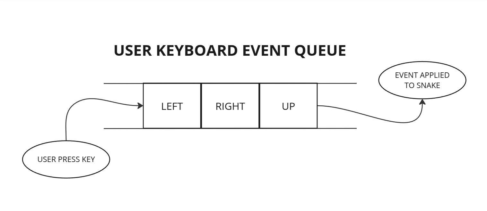

# Snake Game in C++

## About the project

Snake game implemented in C++ using OpenGL and GLFW.
This project wast built to following good architecture with Data Structures and Algorithms.

<p align="center">
  
</p>

## Concepts

- [Snake Tile Data Structure](#snake-tile-data-structure)
- [Collisions Logic](#collisions-logic)
- [Event Queue](#event-queue)

### Snake Tile Data Structure

<p align="center">
  
</p>

The snake game was implemented using a doubly linked list. This data structure allows us to efficiently manage the snake's body segments and create smooth moving animations.

Each segment of the snake is represented as a node in the doubly linked list, with pointers to both the previous and next segments. This setup makes it easy to add new segments when the snake eats food and move the snake as the node takes the position of the next one.

### Collisions Logic

The collision logic is designed to detect when the snake's head collides with certain elements on the grid. This is achieved by calculating the specific grid position (using the x and y coordinates) of the snake's head and comparing it with the positions of other elements such as the border, apples, and other parts of the snake's body. Here are the key steps involved:

1. Calculate Grid Position: Determine the grid position of the snake's head based on its x and y coordinates.
2. Check Self-Collision: Compare the grid position of the snake's head with the positions of the other tiles that make up the snake's body. If they match, a collision with itself is detected, which results in the game ending.
3. Check Border Collision: Compare the grid position of the snake's head with the positions of the grid's borders. If they match, a collision with the border is detected, which also results in the game ending.
4. Check Apple Collision: Compare the grid position of the snake's head with the position of the apple. If they match, a collision with the apple is detected, which typically results in the snake growing longer and the apple being repositioned.

This logic ensures that the game can accurately detect and respond to collisions, maintaining the game's rules and providing a consistent gameplay experience.

### Event Queue

<p align="center">
  
</p>

One of the problems I faced was when the user pressed multiple keys almost simultaneously, only one key (the last pressed) would apply to the snake.

To fix that, I implemented an Event Queue that stores the keys that the user pressed and will apply that as the snake is moving.

#### Implementation of the Queue

```cpp
void Snake::on_direction_change(int direction)
{
    if (this->head_tile == nullptr)
        return;

    // Check if that last pressed key is the same as the new one. If it is, there's no need to store it again.
    if (this->inputs_queue.back() != direction)
        this->inputs_queue.push(direction);
}

void Snake::draw(GLuint shaderProgram, GLuint VAO)
{
  // ...

  if (!this->inputs_queue.empty())
  {
    int current_input = this->inputs_queue.front();

    while (!this->inputs_queue.empty())
    {
        if (this->inputs_queue.front() != current_input)
            break;

        this->inputs_queue.pop();
    }

    switch (current_input)
    {
    case GLFW_KEY_LEFT:
        this->current_direction = SNAKE_DIRECTION_LEFT;
        break;
    case GLFW_KEY_RIGHT:
        this->current_direction = SNAKE_DIRECTION_RIGHT;
        break;
    case GLFW_KEY_UP:
        this->current_direction = SNAKE_DIRECTION_UP;
        break;
    case GLFW_KEY_DOWN:
        this->current_direction = SNAKE_DIRECTION_DOWN;
        break;
    default:
        break;
    }
  }

  // ...
}

```

## Installation

### Dependencies

Before building the project, ensure the following dependencies are installed:

- **g++** (GNU C++ Compiler)
- **libglfw3-dev** (GLFW library)
- **libglu1-mesa-dev** (Mesa GLU library)
- **libglew-dev** (GLEW library)
- **libfreetype6-dev** (FreeType library)

#### Install on Debian/Ubuntu:

```bash
sudo apt update
sudo apt install build-essential libglfw3-dev libglu1-mesa-dev libglew-dev libfreetype6-dev
```

## Compile and Run

```bash
make
./main
```

## Contact

If you have any questions or feedback, feel free to reach out:

- **X / Twitter:** [@angelomarquesc](https://x.com/angelomarquesc)
- **Email:** [angeloemanuelmarques@gmail.com](mailto:angeloemanuelmarques@gmail.com)
