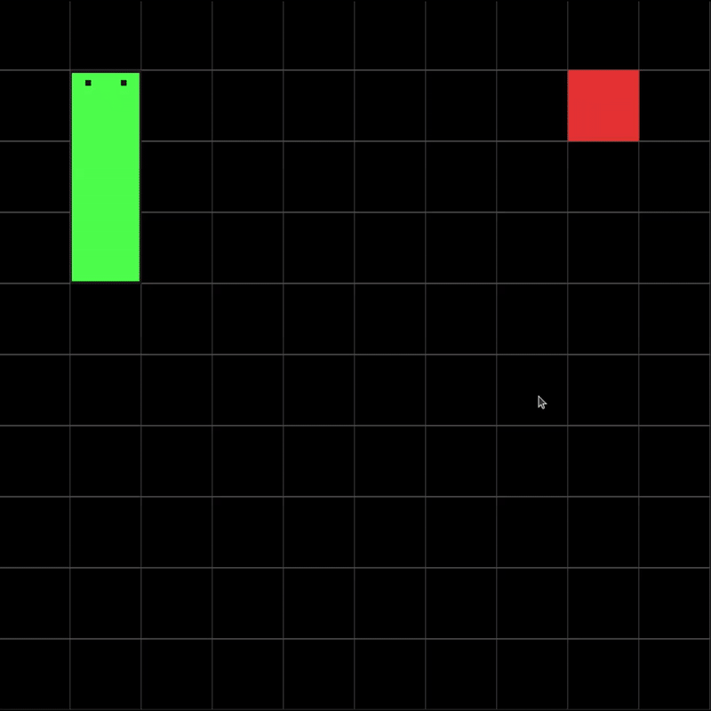

# Snake Game in C++

## About the project

Snake game implemented in C++ using OpenGL and GLFW.
This project wast built to following good architecture with Data Structures and Algorithms.

<p align="center">
  
</p>

## Concepts

- [Snake Tile Data Structure](#snake-tile-data-structure)
- [Collisions Logic](#collisions-logic)

### Snake Tile Data Structure

### Collisions Logic

## How to run (Linux)

<!-- ## How to run

```bash
$ mkdir build
$ cd build
$ cmake ..
$ make
$ ./snake-game
```

## How to play

- Use the arrow keys to move the snake.
- Press the space bar to make the snake jump.
- Press the enter key to restart the game.

## How to compile and run

```bash
$ make
$ ./main
```

## How to test

```bash
$ ./snake-game
``` -->

<!-- - Linked list because we need the info of the next node -->
<!-- - The tail of the snake is the head of the linked list because it's more fast to insert the new node -->
